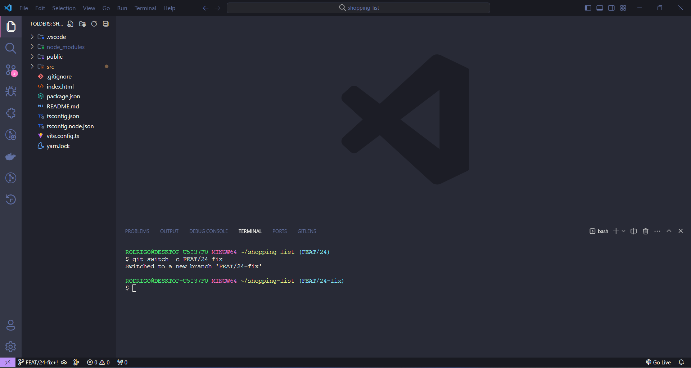

<h1 align="center">Resolver conflito</h1>

O primeiro passo consiste em identificar os arquivos que apresentam conflitos no Pull Request.

 

Abra o Visual Studio Code e certifique-se de estar na branch que está enfrentando conflitos (no meu caso, é a branch FEAT/24).

 

Crie uma nova branch que irá abordar a resolução desses conflitos.

Certifique-se de nomear essa branch da mesma forma que a branch conflituosa, adicionando apenas "fix".

Lembre-se sempre de criar a branch de resolução de conflitos com base na branch que está enfrentando conflitos.

Por exemplo, se a branch conflituosa é 'FEAT/24', a nova branch seria 'FEAT/24-fix'.

 

Realize o pull da branch para a qual você está apontando na pull request para a sua própria branch.

 

Resolva os conflitos e, após concluir a resolução, faça o push para a sua branch.

 

Crie a Pull Request da branch que resolve o conflito (FEAT/24-fix), apontando para a branch que está enfrentando o conflito, no meu caso, 'FEAT/24'.

### Pull Request

FEAT/24 <- FEAT/24-fix

 

Antes de efetuar o merge, revise os arquivos para garantir que tudo está correto.

Após essa verificação, proceda com o merge para a branch que está enfrentando conflitos.

 

Sua branch está livre de conflitos.

 

Para concluir, remova a branch criada para resolver o conflito.

 

Desenvolvido por <a href="https://www.linkedin.com/in/rodrigo-de-jesus-silva/">Rodrigo Silva</a>

